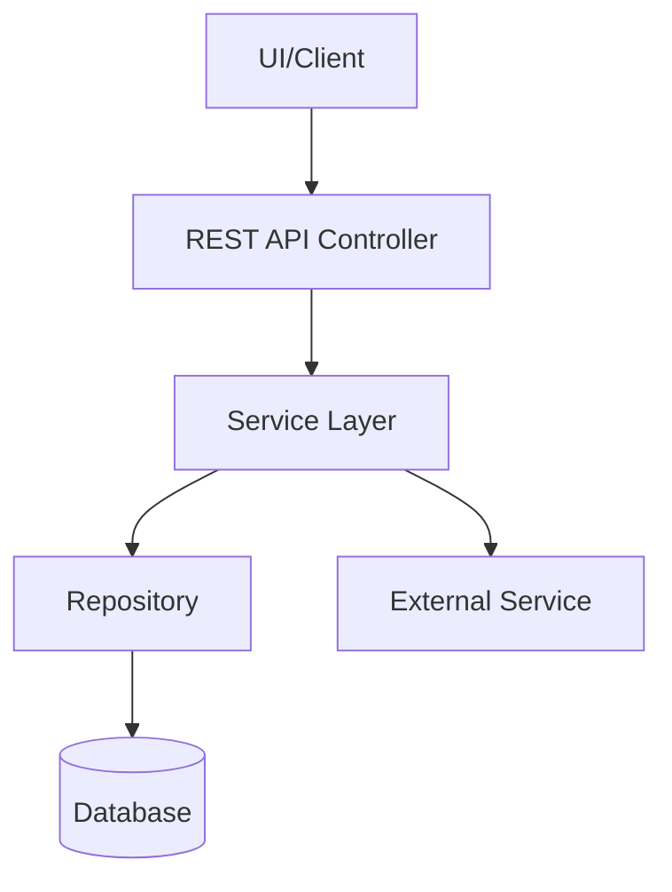

# Architecture Overview

## Component Diagram(s)

_Embed/link diagrams (Mermaid, PlantUML, hand-drawn, etc) or describe in text:_

## Key Details & Integration Points

- Component/Layer: [Purpose/Notes]
- External Interfaces:
    - [API Name/Type]: [Integration Point/Authentication]
- Security Overview:
    - [e.g., AuthN/AuthZ methods, major filters]

