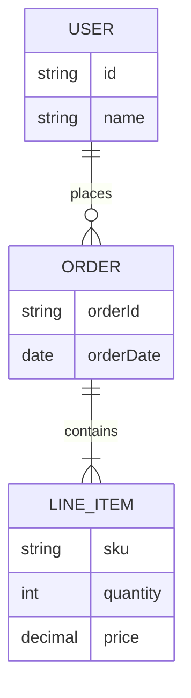

# Data Model (Entities & Relationships)

## High-Level ER Diagram

_Embed/link diagram (Mermaid, draw.io, etc), or describe._

## Major Entity Descriptions

| Entity         | Description                | Main Relationships     |
|----------------|---------------------------|-----------------------|
| User           |                           | Order                 |
| Order          |                           | Line_Item, User       |
| Line_Item      |                           | Order                 |
